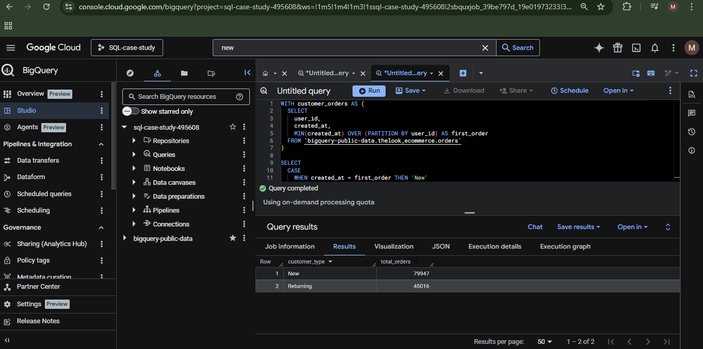

# sql-case-study-ecommerce
SQL analysis of customer behavior and product performance using BigQuery
# SQL Case Study: E-commerce Customer Behavior

## 📌 Overview

This project analyzes customer behavior and product performance using SQL in Google BigQuery.

The goal was to identify patterns that could help improve customer retention and product strategy.

---

## 🛠 Tools Used

* Google BigQuery
* SQL

---

## 📊 Analysis Performed

### 1. New vs Returning Customers

Analyzed customer order history to compare purchasing behavior between new and returning customers.

### Insight

The analysis showed that new customers generated more orders than returning customers, suggesting strong customer acquisition but an opportunity to improve retention and repeat purchases.

---

### 2. Top Products Analysis

Identified the most ordered products across the platform.

### Insight

Certain products consistently generated higher order volumes, highlighting clear customer preferences and opportunities for targeted promotions or inventory prioritization.

---

## 📂 Project Files

* `analysis.sql`
* `customers.png`
* `products.png`

---

## 👤 Author

Melchizedek Daniel Ya'u(Maleek)

## 📸 Query Results

### Customer Analysis

### Product Analysis

